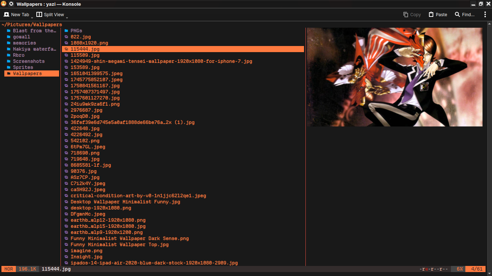

<div align="center">
  
</div>

<h1 align="center">
    Batsu 
</h1>

<p align="center">
  A high-contrast, volcanic-inspired flavor for <a href="https://github.com/sxyazi/yazi">Yazi</a>.
</p>

## 👀 Preview



## 🎨 Manual Installation

Since this flavor is in development, you can install it manually:

1. Create the flavor directory:
   
   ```sh
   mkdir -p ~/.config/yazi/flavors/batsu.yazi
   ```

2. Move your `flavor.toml` and `tmtheme.xml` into that folder.

## ⚙️ Usage

Add it to your `~/.config/yazi/theme.toml`:

```toml
[flavor]
use = "batsu"
```

## ✨ Credits

This flavor is based on the structure of [Eldritch](https://github.com/6ruby1/eldritch.yazi). It features replaced Unicode symbols and a unique color palette.

## 📜 License

The flavor is **MIT-licensed**, and the included `tmTheme` is also **MIT-licensed**.

Check the [LICENSE](./LICENSE) and [LICENSE-tmtheme](./LICENSE-tmtheme) files for more details.
