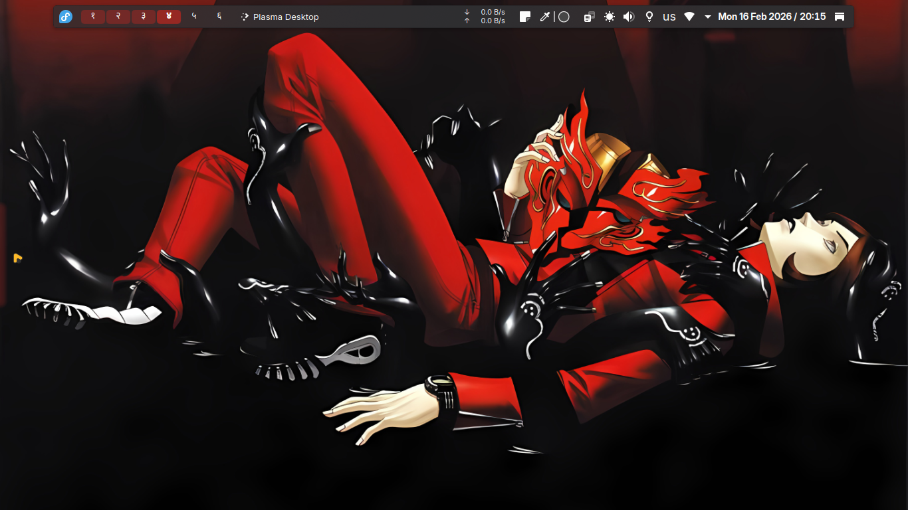

# 🎭 Batsu-Remix

This is what happens when you **want that minimalist WM look**...  
but can’t commit to 500 lines of `config` and Lua sorcery 😅  
(**Spoiler:** I still ended up editing config files anyway.)

Persona 2 duology is one of my favorite games so I just took the colors from the two wallpapers related to that game and created my own color scheme called **Batsu-Remix** and riced my desktop according to it.
Looks like a window manager, behaves like a DE.  
Perfect for lazy perfectionists™.

---

## 🎨 Features

- 🌑 **Batsu-Remix** theme applied system-wide.
- 😖 Our bro Tatsuya Suo contemplating his life choices 🥲.
- 🔢 Devnagri numbers using the [Kara](https://github.com/dhruv8sh/kara/) widget..
- 🎨 App icons themed with [Papirus](https://www.pling.com/p/1166289/).
- 🧠 Fonts used like a nerd who cares:
  - **Terminal** → [Departure Mono Nerd Font](https://github.com/ryanoasis/nerd-fonts/releases/download/v3.4.0/DepartureMono.zip)
  - **UI/Desktop** → [Inter](https://rsms.me/inter/) (classy and readable)
  
---

> Also so I don't live in terminal that much so instead of going for riced nvim I've found a suckless nvim lua script that is doesn't use plugins.   
> It's created by [TheRadLectures](https://github.com/radleylewis/nvim-lite) (his youtube's channel name).
> *It's basically a sleeper build nvim (that's the only way I can put it)*

> The repo is fully browsable and unpacked, a tarball is also available. 

--- 
